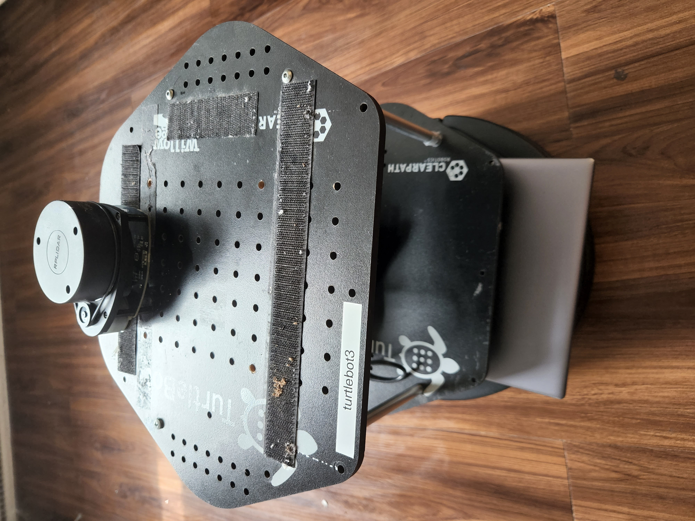

# RSP Final Project

Team Member: 

Guangwei Zhou (gzhou11@jhu.edu)

Jiahe Xu (jxu109@jh.edu)

Time: Spring 2022

Picture of the robot used for this project:

## Overview

In this project, use `gazebo` for simulation, `move_base` package for planning. We also used clustering methods with cloud point data for object detection.

In `follow_path` package we assigned a path and feed the path to `move_base`, then the turtlebot will follow the trajectory if it is reachable.

In `move_turtlebot` package we let turtlebot randomly move in one of the assigned directions according to 'local_costmap' and laser sensor.

In `turtlebot_planner` package we used RTT method and implemented a `move_base` plugin for planning.

Package `front_scan` and `object_detection` use laser sensor to detect obstacles and keep count of the number of obstacles nearby using clustering methods(KD-tree)

Package `cloud_point` is used to convert original laser data to point cloud data.

In our tests, we used perfect maps and map generated by `gmapping`, in the demo (Readme files in each package), we only use perfect map for better result in demo.

The expected deliverables of this project are:

1. Runnable model and test routine in gazebo
2. Robot could locate itself in a well-known environment
3. Robot could detect static obstacles

Packages developed by us are:

- turtlebot_planner
- follow_path
- move_turtlebot
- front_scan
- object_detection
- cloud_pointsimulation

## Instructions

1. Install Ubuntu 18.04
    
    Tutorial (pc): [Install Ubuntu desktop | Ubuntu](https://ubuntu.com/tutorials/install-ubuntu-desktop#1-overview)
    
    Tutorial (virtual machine): [How to run Ubuntu Desktop on a virtual machine using VirtualBox | Ubuntu](https://ubuntu.com/tutorials/how-to-run-ubuntu-desktop-on-a-virtual-machine-using-virtualbox#1-overview)
    
2. Install ROS Melodic
    
    Tutorial: [melodic/Installation/Ubuntu - ROS Wiki](http://wiki.ros.org/melodic/Installation/Ubuntu)
    
3. Install catkin tools
    
    Command: 
    
    `sudo apt-get install python3-catkin-tools`
    
4. Create catkin workspace
    
    Command: 
    
    `mkdir -p ~/rsp_workspace/src`
    
5. Clone this repository
    
    Commands: 
    
    `cd ~/rsp_workspace/src`
    
    `git clone git@github.com:GZHOUW/RSP_Project.git`
    
6. Install external dependencies
    
    Commands:
    
    `sudo apt-get install ros-melodic-kobuki-*
    sudo apt-get install ros-melodic-ecl-streams
    sudo apt-get install libusb-dev
    sudo apt-get install libspnav-dev
    sudo apt-get install ros-melodic-joystick-drivers
    sudo apt-get install bluetooth
    sudo apt-get install libbluetooth-dev
    sudo apt-get install libcwiid-dev
    sudo apt-get install ros-melodic-move-base*
    sudo apt-get install ros-melodic-map-server*
    sudo apt-get install ros-melodic-amcl*
    sudo apt-get install ros-melodic-navigation*
    sudo apt-get install ros-melodic-bfl
    sudo apt-get install ros-melodic-openni2-launch
    sudo apt-get install ros-melodic-yocs-velocity-smoother`

7. Build the packages
    
    Commands: 
    
    `cd ~/rsp_workspace`
    
    `catkin build`
    
8. Run the launch file of each package
    
    Commands:
    
    - turtlebot_planner
        
        `roslaunch turtlebot_planner turtlebot_planner.launch`
        
    - follow_path
        
        `roslaunch follow_path follow_path.launch`
        
    - move_turtlebot
        
        `roslaunch move_turtlebot move_turtlebot.launch` 
        
    - front_scan
        
        `roslaunch front_scan front_scan.launch`
        
    - object_detection
        
        `roslaunch object_detection detection_gazebo.launch`
        
    - point_cloud
        
        `roslaunch point_cloud point_cloud.launch`
        
    - simulation
        
        `roslaunch simulation turtlebot_gazebo.launch`
        

## Results & Demo

Detecting human model with laser sensor is unrealistic in both gazebo and real-life(too many noise and parameters to set, we spent lots of time testing it and we gave up). We do managed to detect pillars and other objects, so we changed our goal to detect nearby obstacles in the area laser sensor covers. All the delivery goals are achieved.

Results are shown in rviz and gazebo simulations, as well as logs printed in terminal.

Video demo can be found in individual packages’ README documentation.

## Hardware problems

The rp lidar has a broken bolt, yet it can still be mounted to the robot. 
