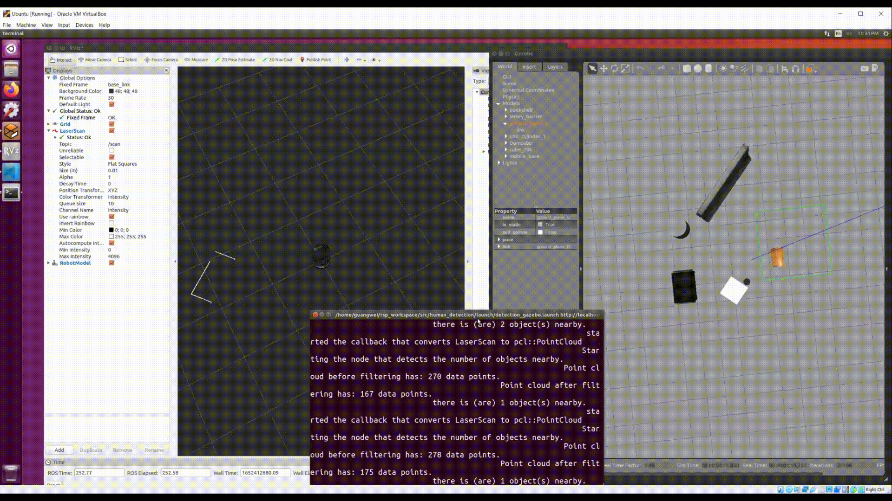

# Object Detection

## Overview

This package aims to allow a turtlebot to detect its surrounding environment and count the number of objects around it. It uses a lidar to obtain laser scan messages, converts them to point cloud messages, and then uses clustering algorithm to segment the point cloud into clusters. The number of clusters would be the number of objects.

## Environment

- Ubuntu 18.04 LTS
- ROS Melodic
- Gazebo
- catkin

## Dependencies

### Catkin Dependencies
- roscpp
- sensor_msgs
- std_msgs
- laser_geometry
- pcl_ros 

## Run Demo

1. Build the package
    
    `cd {workspace_dir}`
    
    `catkin build`
    
2. Run the launch file
    
    `roslaunch object_detection detection_gazebo.launch`
    
    You should see rviz and gazebo gui initialized. Logs will be displayed in terminal.
    
    Wait a few seconds for all the nodes to start up. 
    
3. In the terminal, you will see the number of point cloud points detected, as well the number of objects detected nearby. You can use teleop commands to move the robot around, and the number of objects nearby will change accordingly.

